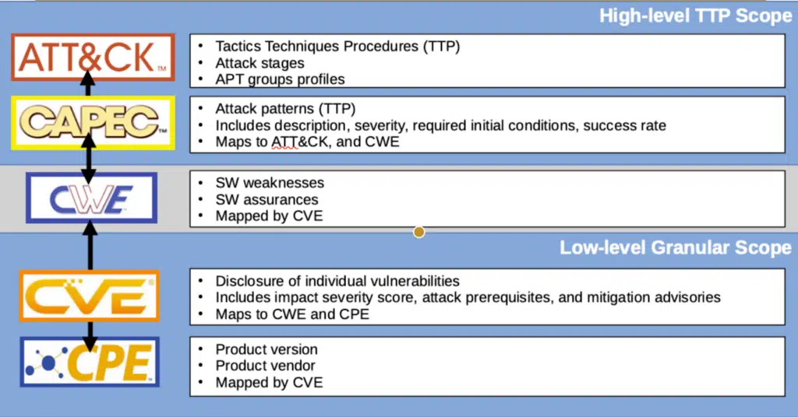
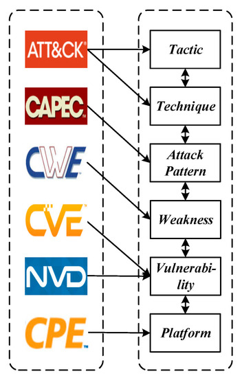

# MITRE

## MITRE Corporation
비영리집단인 마이터 코퍼레이션(MITRE Corporation 및 MITRE)은 정보보안 업계에 강력한 영향력을 끼치는 비영리단체입니다. 

- [MITRE](https://www.mitre.org/): https://www.mitre.org/

그들이 세상에 공개한 Cybersecurity(정보보안) 프레임워크는 다음과 같습니다.

- CPE (Common Platform Enumeration)
- CVE (Common Vulnerabilities and Exposures)
- CWE (Common Weakness Enumeration)
- CAPEC (Common Attack Pattern Enumeration and Classification)
- MITRE ATT&CK 
- MITRE D3FEND
- etc

위의 프레임워크의 관계는 아래와 같습니다.

출처: https://www.nopsec.com/blog/mapping-cves-and-attck-framework-ttps-an-empirical-approach/

출처: https://www.mdpi.com/1424-8220/21/22/7579

플랫폼(제품과 버전 등)의 경우 CVE와 연결되어 있고, 취약점 목록인 CVE는 보안 약점 프레임워크인 CWE에 연결되어 있으며, 그 약점에 대한 것은 공격 기법(CAPEC)과 연결되어 있고, TTP(전략, 기술 및 절차)로 연결됨을 알 수 있습니다.

사진에는 표현되어 있지 않지만 이러한 기술(Technique)의 경우 방어 기법(MITRE D3FEND)으로 연결되겠지요.

## CPE
CPE(Common Platform Enumeration), 공통 플랫폼 목록

- [NIST](https://nvd.nist.gov/products/cpe): 2025년 기준 현재 관리 주체
- [MITRE](https://cpe.mitre.org/): 관리 주체가 NIST로 이관

CPE는 정보 기술 시스템, 소프트웨어 및 패키지를 위한 구조화된 명명 체계입니다. URI(Uniform Resource Identifier)의 일반 구문을 기반으로 하는 CPE는 정식 이름 형식, 시스템과 이름을 비교하는 방법, 그리고 텍스트와 테스트를 이름에 연결하는 설명 형식을 포함합니다. (CPE is a structured naming scheme for information technology systems, software, and packages. Based upon the generic syntax for Uniform Resource Identifiers (URI), CPE includes a formal name format, a method for checking names against a system, and a description format for binding text and tests to a name.)

CPE의 경우 취약점 관리 솔루션이나, CTI(Cyber Threat Intelligence)와 같은 곳에 사용됩니다.

당장 CPE에 대한 개념을 알아야 할 필요는 없으나, 먼저 CVE에 대한 개념을 익히도록 합시다.

## CVE
CVE (Common Vulnerabilities and Exposures), 공통 취약점 목록

- [MITRE](https://www.cve.org/): https://www.cve.org/
- [NIST](https://nvd.nist.gov/vuln/search#/nvd/home?resultType=records): https://nvd.nist.gov/vuln/search#/nvd/home?resultType=records

※ 해당 부분은 CVE에 대한 간략한 부분만 설명드리며, CVE에 관한 상세한 내용은 다른 문서를 참고하십시오.

CVE의 경우 취약점 코드로써 독보적 표준이라고 불릴 수 있습니다. 보안뉴스 [올해 25주년 맞이하는 CVE 프로그램, ‘취약점 관리 체계’ 역사 되짚어보기](https://www.boannews.com/media/view.asp?idx=134006) 기사를 보면 2016년에는 CNA가 24개에 불과했지만 2024년 말 기준 400개 이상의 CNA 기관이 확대되었습니다.

여기서 CNA는 쉽게 말해 취약점 발견 시 신고를 받는 기관으로 실제 Exploit(악용)이 되는지 판단하는 기관으로 볼 수 있으며 기관이 늘어났다는 것은 정보보안 취약점 체계의 표준을 공고히 하겠다는 스탠스를 가졌다는 것으로 볼 수 있습니다.

이러한 CVE를 사용하는 경우는 다음과 같습니다.

- KISA와 같은 국가(공공) CERT 기관의 보안공지: [보안공지](https://knvd.krcert.or.kr/securityNotice.do)
- 미국 국토안보부 산하기관 - 사이버보안 및 인프라 보안국(CISA)의 KEV Catalogs(Known Exploited Vulnerabilities Catalog): [Known Exploited Vulnerabilities Catalog](https://www.cisa.gov/known-exploited-vulnerabilities-catalog)

